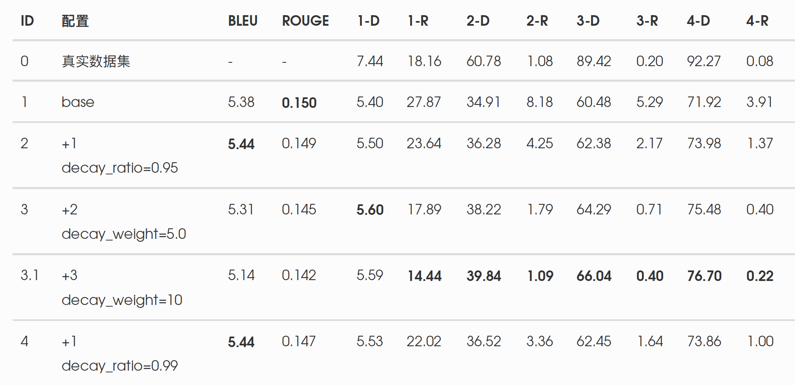
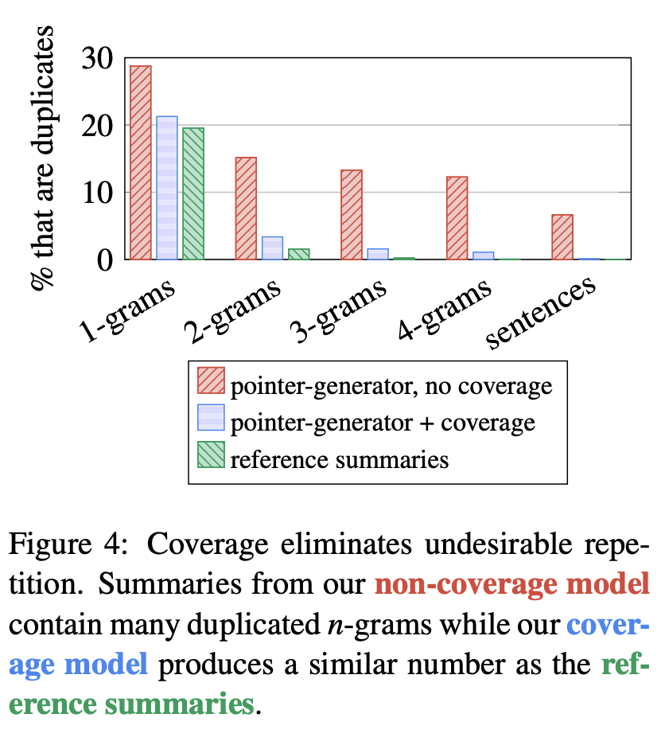
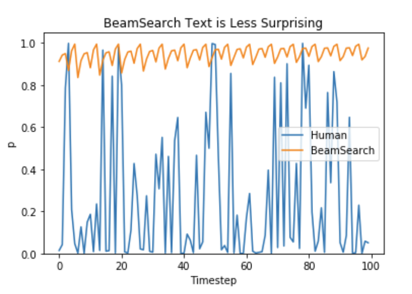

# S2S-in-Production

**欢迎大家Star和PR！毕竟本人个人能力精力有限，希望大家能够补充更多内容**🙂

> 目前项目还在不断完善中，立个flag吧，争取8月底能够完成初版。

## 目录

<!-- TOC -->

- [S2S-in-Production](#s2s-in-production)
  - [目录](#目录)
  - [引言](#引言)
  - [框架选择](#框架选择)
    - [Tensorflow流](#tensorflow流)
      - [OpenNMT-tf](#opennmt-tf)
      - [NMT](#nmt)
      - [Tensor2Tensor](#tensor2tensor)
      - [OpenSeq2Seq](#openseq2seq)
      - [trax](#trax)
      - [Texar](#texar)
    - [PyTorch流](#pytorch流)
    - [MXNet流](#mxnet流)
    - [统计流](#统计流)
  - [OOV/UNK问题](#oovunk问题)
    - [词表改进](#词表改进)
      - [基于字的词表](#基于字的词表)
      - [基于词+字的词表](#基于词字的词表)
      - [基于sub-word-units](#基于sub-word-units)
    - [模型改进](#模型改进)
      - [强制不生成UNK](#强制不生成unk)
      - [Copy机制](#copy机制)
  - [重复问题](#重复问题)
    - [模型后处理](#模型后处理)
      - [N-Gram Repeat Block](#n-gram-repeat-block)
      - [Vocab Decay](#vocab-decay)
      - [Coverage Penalty](#coverage-penalty)
    - [模型改进](#模型改进-1)
      - [Coverage Mechanism](#coverage-mechanism)
      - [Intra Decode Attention](#intra-decode-attention)
      - [Semantic Cohesion](#semantic-cohesion)
  - [多样性问题](#多样性问题)
  - [生成质量的评估](#生成质量的评估)
  - [生成的可控性](#生成的可控性)
  - [预训练的有效性](#预训练的有效性)
  - [多样性的输入](#多样性的输入)
  - [事实型错误问题](#事实型错误问题)
  - [模型加速](#模型加速)
    - [模型压缩](#模型压缩)
    - [模型蒸馏](#模型蒸馏)
  - [相关的其他问题](#相关的其他问题)
    - [强化学习+S2S？](#强化学习s2s)
    - [各种生成方法的简介](#各种生成方法的简介)
    - [一些还不错的资源](#一些还不错的资源)

<!-- /TOC -->

## 引言

分享一些S2S在实际生成的应用中遇到的问题和解决方法。**欢迎大家发PR补充自己的意见。**

> - 这里主要是关于生成相关的任务，所以其他的任务可能不适用。
> - 文档会不断完善，但仍然会有很多分析和数据可能会缺失【各种坑】（懒-_-），大家就取其精华去其糟粕吧。
> - 这些是我们团队在使用S2S时的一些经验和总结，总会存在一些错误或者纰漏，所以如果有更好的经验欢迎分享。

默认大家已经比较熟悉S2S架构，并且跑过一些实验了，所以不做过多的介绍，直接进入正题吧。当然，如果本文受欢迎的话还是可以补充各种基础知识的😆

## 框架选择

对于刚开始学习S2S的同学，我是建议自己去实现一下基本的S2S的模型的，gay佬交友网站上已经有一堆人用pytorch和tensorflow实现了各种S2S的模型，有兴趣的可以去看看。当然也可以看我两三年前参考各种别人实现写的[seq2seq](https://github.com/xueyouluo/my_seq2seq)（不过还是上古时代的LSTM的那套😂）。

对于专业人士来说，手撸一套s2s框架肯定毫无压力，但是对于我这种比较懒的人来说，直接用别人写的改改还是香😁。所以这里介绍几个S2S框架（当然，很多我也只是知道个名字😂）推荐给大家，大家各取所需。欢迎━(*｀∀´*)ノ亻!补充。

当然这样再稍微探讨一下框架的优劣，我司有同学喜欢自己维护一套代码（程序员都喜欢从头来一遍），这样的好处是对这套代码非常熟悉，用起来改起来都非常方便。但是坏处就是其他同学想用你的代码就有学习成本，而且你加的新feature也没法跟别的框架的feature合起来用。框架的好处是大家用的多了就比较熟悉了，都可以在上面加新feature，方便共享成果，但坏处就是框架一般就不太灵活，想加新功能可能得改到好几处地方（当然，牛逼的框架做的好还是只要改一点点地方）。我是建议一个团队或者一个组的同学在做S2S任务的时候都是共同维护一套框架的，而且每位同学都要非常熟悉源代码，这样工作效率会更高。

### Tensorflow流

#### OpenNMT-tf

框架地址：https://github.com/OpenNMT/OpenNMT-tf/

**Star: 1.1K**

虽然star不多，但是个人觉得这个框架写的是挺不错的，代码结构比较清晰合理，模块化做的也挺好，基于它上面加一些feature的话也不难。我们组内部也是基于这个框架的进行二次开发的，同时它也有个CTranslate2的项目，能够帮助提高inference时候的效率，可谓是训练、服务一条龙了。

它目前支持s2s、分类、序列标注、语言模型等任务，模型结构也方便你自由组合，比如encoder使用transformer，decoder使用rnn这样，或者层次的encoder结构等等。当然还有很多其他的feature，比如梯度累积，分布式训练，混合精度等，有兴趣的同学可以去github上看看。它早期是基于tf-1.X的版本开发的，现在已经升级到了tf-2.X，习惯tf-1.X的同学得切换到老版本的分支。

推荐指数： :star::star::star::star::star:

> 推荐指数是本人主观倾向的，不具备客观性，大家参考一下就好😂

#### NMT

框架地址：https://github.com/google/seq2seq

**Star: 5.3K**

这里有两个框架，应该说是有一定的继承关系吧，一开始的时候tf上还没有比较好的seq2seq的框架，Denny在tf应该是tf比较早期的版本开发了这套seq2seq的代码，实现了一个比较完整的S2S的流程，比如训练，比如attention，比如beam search。那个时候主要就是看他的代码来学习S2S。当然他用了很多自己的实现，后来应该集成到了tf.contrib.seq2seq模块中，总体来说作为学习可以看看，现在不推荐使用了，我记得当时为了用他这个代码做serving耗费了很大的精力。

推荐指数：:star::star:

框架地址：https://github.com/tensorflow/nmt

**Star: 5.5K**

nmt这个是后来出来的，我觉得非常适合初学者去学习s2s，它的文档写的非常详尽，是一个hands-on的教程。有一段时间我们用的s2s框架就是它，但是由于是基于LSTM的，所以训练大模型的时候那个时间，一言难尽，我甚至跑过一个月的模型。后来transformer刚出来的时候，斌哥建议我们看看，但是当时没有太在意，现在想想那时候实在是太慢热了，使用transformer可以节省多少时间啊。

推荐指数：:star::star::star::star:

#### Tensor2Tensor

框架地址：https://github.com/tensorflow/tensor2tensor

**Star：10.2K**

这个框架当时有一统江湖的意思，文本图像的任务都涵盖了。当时挺兴奋的就去用了，但是发现代码结构对我来说有点复杂（coding水平低吧我），处理通用任务还是不错的，但是不知道改起来要从哪里入手，所以后面就放弃了😂。现在貌似迁移到trax这个库里面去了，后面再介绍。

推荐指数：:star::star::star:

#### OpenSeq2Seq

框架地址：https://github.com/NVIDIA/OpenSeq2Seq

**Star：1.2K**

NVIDIA出的s2s框架，所以什么混合精度、加速这类的肯定没毛病，也是个大杂烩，啥都有。当时看混合精度训练的时候看过这里，现在tf官方就支持了混合精度了，不需要再搞个nvidia的docker了，所以也就没关注这个框架了。

推荐指数：研究不多，没法打:grinning:

#### trax

框架地址：https://github.com/google/trax

**Star：4.6K**

这个框架是在看Reformer这篇论文的时候发现的，它自己说是`Trax code is structured in a way that allows you to understand deep learning from scratc.`师傅领进门，剩下就看每位同学自己的修为了:smile:。同时它自己声称google brain team就经常用这个框架，它里面的attention的形式（当然是指self attention）倒是很多，方便大家自由组合各种形式的attention。

它使用了jax，貌似又是个新玩意，据它自己说是可以直接对numpy和python的function直接求导，应该是让你更直接使用python来写模型了，连tf都不需要了吗:confused:？现在的话感觉文档不是很齐全，很有tf的风格😂

推荐指数：研究不多，全凭兴趣吧，指不定未来也是个趋势

#### Texar

框架地址：https://github.com/asyml/texar

**Star: 2K**

没啥研究，不好评价。

### PyTorch流

剩下的我就简单介绍了，因为我是tf的用户，其他的基本没怎么用过。

框架地址

- https://github.com/OpenNMT/OpenNMT-py
  - **Star: 4.3K**

- https://github.com/pytorch/fairseq
  - **Star: 8.5K**

OpenNMT-py跟OpenNMT-tf都是来自OpenNMT的，但是它实现一些比较有用的feature，比如copy机制、coverage机制等，不过也可以在tf上实现，稍微麻烦一些。

fairseq是facebook搞的，原来在看CNN做S2S的论文的时候发现的，研究不多，因为transformer出来之后就已经很香了😂

> 从star数量来说可以看到，tf的很多是用tensor2tensor这套框架，pytorch应该是fairseq，看来我们自己用的还是比较非主流。

### MXNet流

框架地址：https://github.com/awslabs/sockeye

**Star：943**

这个star有点可怜，现在MXNet也不知道到底有多少人用了，前段时间听说MXNet就流失了很多人，估计也就亚马逊在用了吧。

### 统计流

框架地址：

- http://www.statmt.org/moses/
- https://github.com/moses-smt/mosesdecoder

**Star：1.2K**

传统的统计机器翻译的经典框架。其实现在很多S2S的改进也是借鉴了SMT的思想，经典的还是经典，很多idea是通用的。安装使用有点麻烦的，不过学校里面学机器翻译肯定得学这个😆，我用它来做过平行语料的phrase table的提取，但是感觉噪声太多，后来还是放弃了，直接end2end香。facebook一篇无监督翻译的论文用到这个， 效果还不错，但是后来NLP的pretrain火起来后，直接就被超过了，这个参考[XLM](https://github.com/facebookresearch/XLM)。

## OOV/UNK问题

NLP中的神经网络模型都是固定词表大小的，遇到OOV的词我们一般给它们一个特殊的标识符`<unk>`，这样就导致模型在预测阶段有时候会输出`<unk>`字符，尤其是词表越小的时候情况越严重。在NLG任务中，我们一般是不愿意模型生成`<unk>`的，因此我们需要想办法避免这种情况。

我们的解决方法可以分成两类，一类是针对词表本身进行改进，另外一类针对模型进行改进（如使用copy等）。

### 词表改进

#### 基于字的词表

比较简单的想法就是不用词，而是换成字来训练模型，一般我们中文的字的数量级也就在几千左右。采用字的词表可以大大减少模型的复杂度，但是问题也是显而易见的，一个就是输入或者输出的长度会大大增加，其次使用字的话我们就丢失了词的信息，需要模型自己从数据中学到字的组合。一般在s2s中大家还是比较少用完全基于字的模型的，主要应该也是字的模型效果没有词的好。

但是有些情况下我们还是用了字的模型，比如古诗、对联生成等任务，主要是认为古文中一般一个字就蕴含了词的信息，或者本身输入输出就不长任务较简单。一些语言模型也是基于字做的。

> 当然目前bert中文的模型也就是用字的，效果也很好

#### 基于词+字的词表

比较多的论文中为了解决OOV的问题将词表变成两个，一个基于词的，一个是基于字的，然后将两者结合起来使用。

比较常见的做法是：

- 对于一个词，如果在词表中，那么可以直接拿到它词的embedding，不在的话我们可以拿unknown的embedding或者直接取0向量。
- 同时也会将这个词中所有的字去获取字的embedding，再将字的embedding通过cnn或者rnn的方法变成一个embedding，与词的embedding拼接或者相加。这种方法的好处既可以用上词的信息，而oov的词又可以利用到它里面字的信息来得到词信息的近似。

- 同样的，在生成的时候，如果生成了`<unk>`就会退化成基于字去生成词。

前面的方法理论上来说确实比较好，但是需要涉及到修改模型的输入输出结构，涉及到的改动较大。可以采取一种比较简化的版本（本人懒-_-），也即是：

- 词和字使用同一份词表，取top-K个词+top-M个字共同组成。
- 对数据处理的时候遇到OOV的词就直接把它拆成字，这样训练和测试的时候都不会遇到`<unk>`，我们期望模型能够学到字的组合信息。
- 这种方法训练出来的模型基本上没有出现`<unk>`的词。但是整体效果并没有提升。

> 这里我突然发现，我们在训练的时候应该随机把一些非OOV的词也拆成字，这样模型才能更好的学习到字的组合信息。这里留个坑，有兴趣的话可以做做实验。

#### 基于sub-word-units

这个应该是目前最常见的方案了。这个好处是把词切分成一些更细粒度的词，但是比字的粒度又更大一些，因此可以认为它是上一种方法在词和字之间的一个平衡，比词信息少但比字的信息又多。这种方法与上面类似，也是遇到OOV的词时候用子词来组成它，但是极端情况还是会出现都拆分成字的情况。

记得在NMT的一篇论文【占坑】中使用了BPE的方法，将词拆分成子词，在翻译任务中对bleu有提高。英语法语这些语言由于有词缀等，所以可以分成子词共享一下信息，效果会比较好。

这里sub-word-units也是有很多不同的实现方法的，推荐google的[sentencepiece](<https://github.com/google/sentencepiece>)工具，提供了多种实现，大家可以自行尝试。目前我用的基本是里面的unigram算法。

对于中文来说，有两种方式来使用sentencepiece，一种就是直接不分词将整个字符串丢进去，模型自己学组合（这里有时候会出现一些比较奇怪的词，有兴趣的同学可以看看它的算法，估计也可以用来做新词发现或者分词【又留坑】）；另外一种是分词后再调用sentencepiece，大家可以比较一下二者的效果【留坑】，个人记得应该是差别不大，有时候前面一种方法效果还更好。

### 模型改进

#### 强制不生成UNK

语言的表达是多种多样的，所以我们相信即使要使用到OOV的时候也可以换个说法表达出一样的意思。那么最简单直接的方法就是在S2S做inference的时候，我们改变词表的概率分布，将UNK这个词的概率设置成0（一般通过把UNK的logits减去一个非常大的数实现），这样我们就很happy的看到没有UNK出现了。

#### Copy机制

当然前面那个方法是比较暴力的，但是个人觉得简单的才是有效的。大家研究比较多的还有就是copy机制了，思想其实很简单，对于输入中一些不在词表的词，我们是可以直接把它copy到输出中去的，比如有一些专有名词、一些数值内容，直接靠生成的话容易出现UNK或者不准确的情况。

这里列出两篇论文大家可以去参考：

1. CopyNet -[Incorporating Copying Mechanism in Sequence-to-Sequence Learning](<https://arxiv.org/pdf/1603.06393.pdf>)
2.  Point-Generator - [Get To The Point: Summarization with Pointer-Generator Networks](<https://arxiv.org/pdf/1704.04368.pdf>)

这里就不展开讲解这两篇论文了【占个坑吧】，个人觉得point-generator的思想比较简单，实现起来也更方便，而copynet就比较麻烦些，所以用PG就好了。

如果大家看过PG的源代码或者自己尝试实现过的话，可以发现其实你还要额外维护一个OOV的词表用来做copy用，这个实现起来还挺不方便的，可以采用一个简化的版本（是的，又来偷懒了-_-）。前面提到过sub-word-units，因此我们可以保证输入的词不会被转换成UNK的（当然有例外，比如训练spm的时候没见过的字），那么我们就不需要维护那个额外的OOV词表了，直接copy输入的词就好了，这样encoder这边就不需要改动了，只需要改动decoder这边的生成词表概率这部分就好了。

> 这里补充一点，我们组兴华同学提到用transformer实现pg的时候，copy attention部分最好使用multi-head attention的结果（你可以取其中一个头的结果就好），自己另外算一个attention的话模型比较难收敛。
>
> 再补充一点😂，如果你自己预训练了T5模型的话，其实可以不用太担心OOV的问题，因为T5模型本身就比较倾向于copy的，所以spm + T5 + 强制不生成UNK基本也就够用了。

## 重复问题

生成里面**重复**也是一个非常常见的问题，不论是在S2S还是单纯的LM，同时这个问题跟多样性也是非常相关的，我们先介绍一下重复问题，但是大家结合着多样性一起看。这个问题我个人认为应该是跟训练时的loss有关，我们的loss基本都是使用了cross entropy，就是尽可能让下一个词的概率最大化，所以生成的时候也是倾向于生成概率最高，更不容易出错的词；但是我们知道语言是非常灵活的，同样的意思也可以有无数种表达方法，训练时只提供了一种标准答案，也照成了训练和预测时的不一致。

在《The Curious Case of Neural Text Degeneration》这篇论文作者研究了文本生成中重复和无意义词产生的原因。文章指出使用最大化概率的decode方法，比如beam search和greedy search，会让生成的文本一直保持较高的概率，容易陷入重复的问题中，而且只要一开始重复，后面就会不断重复（这可能是transformer或者lstm模型的结构问题，它们attention到最近的词，或者有recurrent的情况），但是实际人类写的文本并不是一直按照最可能的词去写的。

在重复性这块已经有很多相关的论文了，我把解决重复问题的方法也分成两类：一类是训练好之后decoder的改进（简称后处理吧），一类是训练时就把重复这个问题考虑进去的（简称模型改进吧）。

### 模型后处理

模型后处理的好处是不需要重新训练模型，只需要在decode阶段加一些限制条件，就能够减缓重复问题，非常方便。我一直认为S2S模型在这么大的参数量和数据量下，已经能够学到一个非常好的语言模型了，所以你在decode阶段加一些限制，它也能够输出一段通顺的文本。而且beam search其实就是通过算score来挑选candidates的，而这个score其实你可以自由的定义，使得它非常方便的扩展。

#### N-Gram Repeat Block

顾名思义，我们强制模型在生成的时候不能生成**连续重复的n-gram**，可以把n设为2、3、4、5等。这个思路是比较简单直接的，因为我们可以发现模型大部分情况下生成的重复内容都是连续的，比如“我 也 不 知道 不 知道 不 知道 不 知道”，那么通过现限制n-gram的重复，出现了第一个“不知道”后，那么紧跟着它的就不能再次生成“不知道”。

这种思路实现起来也比较简单，你只需要记录好已经生成的前几个token是什么，在生成当前token的时候，把会引起n-gram重复的token的概率值设为最低就可以了。

但是这种方法大家想一下其实发现它会有一个问题，你虽然限制连续重复的n-gram，但是它仍然会出现另外一种形式的重复。以上面的例子来说，已经生成了“我 也 不 知道 不”后，那么后面“知道”的概率会被设得非常低，模型可能就生成了“我 也 不 知道 不 明白”，但是再继续生成的时候，模型可能就会陷入这样的循环中：“我 也 不 知道 不 明白 不 知道 不 明白 不 知道 不 明白”。一种方法是你可以实现一个同时限制多个n-gram重复的策略，比如不能同时生成重复的2,3,4-gram，那么前面的问题可以得到缓解；另外一种方法是我们可以扩大我们限制的范围，将“连续重复”修改为“区间重复”，即在一定长度的窗口内，不能出现重复的n-gram内容。

这个方法非常简单直接，而且已经可以帮助减缓很多重复的问题了，很多s2s的框架都已经带了这个实现，比如OpenNMT-py，大家可以参考。

#### Vocab Decay

N-gram的方法虽然简单，但是还是存在一些问题，为了进一步缓解长距离的重复的情况，我们提出了vocab decay的方法（可能已经有论文已经写过了，只是我还没有发现），这个方法的思路也很简单，就是记录已经出现过的单词和它们的累积概率，在生成下一个单词的时候，将出现过的单词的概率按照一定的权重降低，这样使得生成出来的结果里面重复度进一步降低。具体的公式如下：

> score = score - **decay_weight** * decay_probs
>
> decay_probs = current_vocab_prob + **decay_ratio** * decay_probs

其中score就是beam search在选择beam时计算的score，decay_probs记录了当前这条beam的单词累积概率，decay_weight是一个可以调节的权重，越大则越不容易生成已经出现过的单词，我们设成5-10左右，可以自己tune一下找到最合适的。而decay_probs的计算考虑了当前选取的单词，同时对历史的单词会有一个衰减（decay_ratio<1，一般取0.9-0.99），这样可以让很早之前出现过的单词在后面也允许其再次出现。

这个方法在我们的实验中效果表现很不错，重复度和多样性都能够得到提高，甚至有时候能够提高模型的bleu值，这个我们理解是因为重复减少了带来的一点提升（大家可以想想为什么？）。下面是我测试的结果（由于是短文本生成长文本，因此bleu和rouge都会偏低，again，为什么呢🙂？）。可以看到多样性虽然提升不大，但是重复性已经降低到接近真实数据了。

> 其中1-D，2-D这类是模型多样性的指标，它的含义如下：
>
> - 统计生成结果中n-gram集合的数量，并除以总的token数量以防⽌⻓句子带来的bias。用这个代表生成的结果的多样性效果。该指标越⾼越好。
>
> 1-R，2-R这类是模型重复性的指标，它的含义如下：
>
> - 统计每一个结果中n-gram集合的数量并除以总的n-gram数量，然后对所有的结果取平均。⽤这个代表生成结果有多少⽐比例出现了重复的n-gram。该指标越低越好。

当然这个方法也是比较简单暴力的，我们对每个单词都一视同仁了，而在真实场景下，有些单词它本身出现的概率就会比其他单词要低（或者更高），概率低的词本身是不太可能重复出现的，我们可能不希望抑制这种情形，比如生成里面包含了实体，而这个实体可能比较少见。针对这种问题，我们可以引入统计的单词概率分布作为先验知识，然后针对场景设计特定的策略来对概率值进行调整。

> 这个坑有兴趣的同学可以填一下😂

#### Coverage Penalty

Coverage是指主要是在翻译的场景下，会有漏翻和过翻的情况，我们希望翻译的结果能够完整的表达原文的意思。这个应该在SMT的时候就提出过了，后来被借鉴到NMT的领域，相关的论文可以参考：

- 《Modeling Coverage for Neural Machine Translation》：Noah’s Ark Lab的论文，他们在NMT的改进上做过很多研究，比如前面提到过的copy机制
- 《Google’s Neural Machine Translation System: Bridging the Gap between Human and Machine Translation》：google的GNMT，虽然较早了，但是介绍了把NMT真正用于生产的很多内容，coverage主要在decode的部分

我们使用的是GNMT中提到的方法，在beam search中加入coverage penalty的loss，以期能够防止模型过度attention到src端相同的部分从而产生重复。从实验结果上来看，通过加入coverage penalty可以轻微的降低重复的指标，但是不如前面提到的方法明显。同时我们也发现通过控制coverage penalty的权重，可以使得生成的结果会有一些多样性。

> 还有一个比较常见的加在beam search这边的策略是length penalty，使得生成的结果不会倾向于短的句子。不过从我们使用下来，感觉这个penalty作用不是很大，基本上也不怎么加这个penalty了。

### 模型改进

前面说的内容是针对模型已经训练好了之后的重复问题优化，如果我们能够在模型训练的时候就考虑到这个问题，那么我们也就不需要再进行后处理了（当然，加入后处理可以进一步避免重复问题）。由于这块我没有做过太多的实验，所以以介绍一些论文思路为主，当然这块也经常作为论文一部分创新点作为一个小章节（毕竟很难单独拿来写一篇论文吧😂）。有兴趣的同学可以补充一下。

#### Coverage Mechanism

我最早看到的（当然不是指这个问题最早研究的）应该是Abigail的[PG](https://arxiv.org/pdf/1704.04368.pdf)的论文里面介绍的coverage mechanism，但是大家其实都更关注了她copy这部分的内容，这块在实验中显示确实减低了重复度。主要的思想是维护了一个coverage vector，记录了到当前时间步为止的attention的总和，可以认为是attention机制对source tokens的coverage程度。这个vector作为attention机制的额外输入信息，使其能够在计算attention的时候考虑到原来已经attention过的信息。并且额外加入了一个coverage loss来惩罚重复attention到相同位置，这个loss的计算跟我们前面提到的coverage penalty有一些不同，因为在摘要场景中不需要要求coverage的分布是均匀的，具体的区别大家可以去看看论文。

下图展示了加入coverage机制后对重复的减缓作用，看着还是不错的。

#### Intra Decode Attention

其实这个现在拿来说有点晚了，毕竟transformer出来了，但是为了混点内容就顺便介绍一下吧😂。

> 论文是《[A DEEP REINFORCED MODEL FOR ABSTRACTIVE SUMMARIZATION](https://arxiv.org/pdf/1705.04304.pdf)》，使用了RL的方法来做摘要，在指标上是比PG更好一些。

在原来的基于LSTM那套的S2S模型中，我们知道attention只发生在decoder和encoder之间，而deocder内部是没有attention的，因此作者觉得我们在生成当前token的时候应该看看我们原来生成过哪些内容，这样避免生成重复的内容。因此作者提出了intra decode attention这个机制，其实就跟现在的transformer这边decoder的self-attention一样啦，所以大家用transformer就好了。

> 但是其实即使是transformer还是会有重复的问题，因此仅仅self-attention还是不够的，可以参考PG的思路在loss里面加入点重复的loss来让self-attention能够知道应该关注重复的问题，这个当然也交给大家自己去填坑啦😄，有效果记得回来跟我说一下哦

#### Semantic Cohesion

这是在论文《[Deep Communicating Agents for Abstractive Summarization](https://arxiv.org/pdf/1803.10357.pdf)》提出来的，这篇论文在摘要任务上又比前一篇论文指标又有提升，但是感觉有点复杂（BTW，微软发的论文好像都把模型搞得挺复杂的，或者就是把别人的点子做的更一般化）。这个方法也是在论文里面非常小的一部分内容，它主要是在decode的时候记录了句子分隔符的位置，然后使用每个短句最后的hidden state来计算句子间的相似度，在最后的loss中加入这个相似度从而让模型不生成重复或者说太相似的句子。貌似文章没有提这个方法在重复度方面的提升，只说了它在最终rouge值上的帮助。

> 因为这个是比较早的时候关注的问题了，所以最近是否有更新也没有太注意。总的来说大家还是在loss上做文章的，不过因为这些都比较复杂（需要改模型重新训练模型），我们发现后处理已经比较好的解决我们的问题了，所以也就没有做过什么实验了。

## 多样性问题

下图展示了使用beam search的时候每个词的概率，相比人类写的，可以发现机器生成的词更没多样性更容易预测。

## 生成质量的评估

## 生成的可控性

## 预训练的有效性

## 多样性的输入

## 事实型错误问题

## 模型加速

这里的模型加速主要不是介绍训练时候的加速，是指在部署到服务端的加速（如果对训练加速有兴趣的同学可以移步我这篇博客《[搞定大模型训练](https://xueyouluo.github.io/how-to-train-big-models/)》，其实主要就是混合精度、分布式训练这些）。

### 模型压缩

### 模型蒸馏

## 相关的其他问题

### 强化学习+S2S？

### 各种生成方法的简介

### 一些还不错的资源

这里补充一些S2S有关的资源吧，想到了或者看到了我就再加进来，可能都记录在比较分散的地方了，刚好放这里做个总结和归档吧。

- [NLP-progress](https://github.com/sebastianruder/NLP-progress)
  - 一个关注NLP进展的github项目，里面有NLP各个领域的SOTA模型，当然也包括了机器翻译和摘要，大家可以看看最新的进展是啥。说起来这位哥挺有意思的，我当时在看NLP的预训练方法，openai应该是有门课介绍了语言模型预训练再进行finetune的，然后他是主动联系了这门课的老师说可以把这个点子发个论文，于是就有了ULMFiT这篇，我当时还尝试自己实现了一下，虽然这篇论文的方法后来马上被GPT和BERT给淹没了，但是还是后来的论文都或多或少都会提到这篇论文。后面逛到这个github项目，发现这个作者就是那位小哥，哈哈。看他目前在deep mind混的风生水起啊，论文发的挺多。